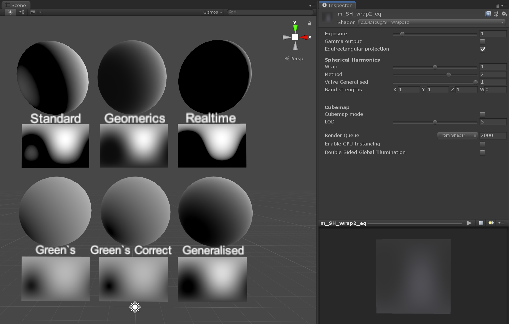
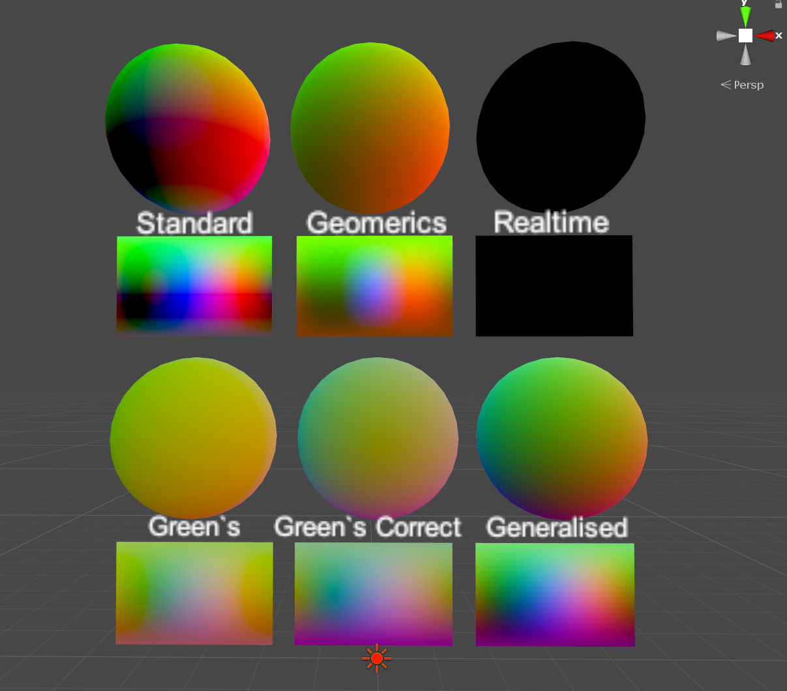

# Wrap shading with support for Unity SH

A personal case study of wrap shading and a usable implementation that supports Unitys spherical harmonics.  
Multiple methods are implemented for easy comparison, including down-sampled cubemap when using skybox as the ambient source, see screenshots below.  
Also includes editor script to check how each of the SH coefficients are composed into the shader parameters. 
  
Original intended use case was for achieving semi-realistic toon shading with baked lighting. Experiments shown some wrap configurations with >1 wrap factor give nice and and highly softened results that work well even in most harsh light conditions!  
   
All used publications and code sources are in comments and linked down in shader and script source code.

