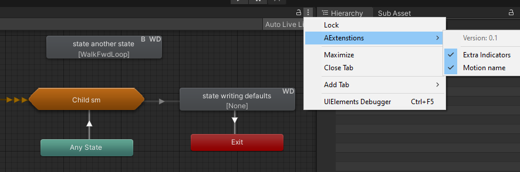
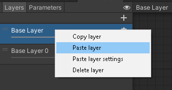

# Editor tools

## Animator Extensions
Some [Harmony](https://github.com/pardeike/Harmony) -based patches to Unitys Animator window:  
* Layer copy-pasting and duplication (including cross-controller) via context menu or keyboard shortcuts
* F2 keyboard shortcut to rename selected layer
* Instead of the annoying list scrollbar reset, get new or edited layer in view
* Similarly scroll to bottom when adding a new parameter
* Prevent transition condition mode/function resetting when swapping parameter
* Highlight/select animator controller by single/double-clicking its path in bottom bar
* Show extra labels on animation states, both toggleable via window menu:
  * Animation clip or BlendTree name
  * `B` if has StateBehaviors
  * `WD` if has Write-Defaults enabled
* Disable undo of "Paste Sub-Sate Machine" action as it leaves dangling sub-assets.  
Manually delete pasted layers or sub-state machines to correctly dispose of majority _(but still not all)_ of sub-assets!

## Material Cleaner
Full window to display material keywords, property stats and and allow quick cleanup of unused ones.  
Also has single click way to cleanup multiple materials via Toolbar->`Tools/DJL/Cleanup Material properties`.  
Skips materials with missing/invalid shaders so hopefully should not damage assets.  
Extra feature: cleanup unused material remaps of imported models. Acessible by context/right-click menu of the model inspector.  
	> _When a material gets renamed/deleted in modeling software and reimported to unity, the old material reference is no longer
	visible through regular user interface and bloats exported packages_

## Point-cloud mesh creator

## Material object locator
With some material shown in inspector, right-click its header to select and highlight material object in project window, just like Unity allows to select the shader

## Mesh asset saver
Right click `Mesh Filter` or `Skinned Mesh Renderer` component to save its mesh as an asset. Useful for saving runtime(script)-generated meshes.  
One of the options allows to **overwrite the mesh bounds** with the ones specified in `Skinned Mesh Renderer` component.  
Can also manually copy and paste (Skinned)MeshRenderer bounds.

## Mesh bounds inspector
Makes `Mesh Filter` components show bounding box like `Skinned Mesh Renderer`s do