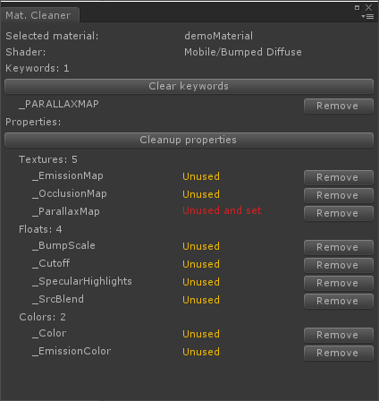
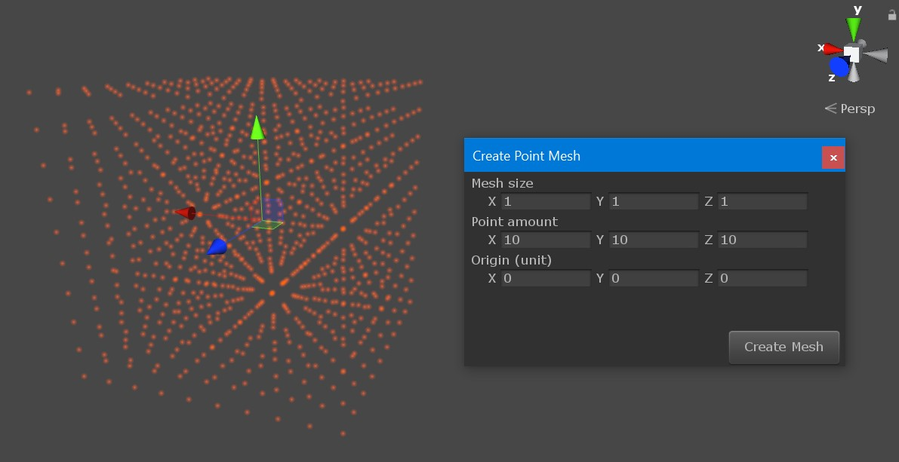

# Editor tools

## Material Cleaner
Full window to display material keywords, property stats and and allow quick cleanup of unused ones.  
Also has single click way to cleanup multiple materials via Toolbar->`Tools/DJL/Cleanup Material properties`.  
Skips materials with missing/invalid shaders so hopefully should not damage assets.

## Point-cloud mesh creator

## Material object locator
With some material shown in inspector, right-click its header to select and highlight material object in project window, just like Unity allows to select the shader

## Mesh asset saver

Right click `Mesh Filter` or `Skinned Mesh Renderer` component to save its mesh as an asset. Useful for saving runtime(script)-generated meshes.  
One of the options allows to **oververite the mesh bounds** with the ones specified in `Skinned Mesh Renderer` component.