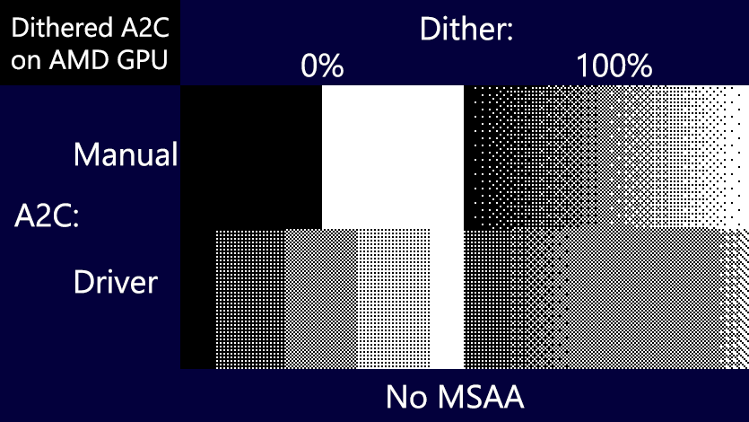

# Shaders  

* ## A2C-Custom
    Custom dithered "Alpha to coverage" shader that does not rely on GPU vendor implementation details (like AMD using dithering while Nvidia not) and allows outputting custom alpha values for application-specific needs.  
    A preview of what happens on AMD GPU when trying to dither alpha for native A2C:  
    
* ## [Stage FX](StageFX)
    (Older versions of) shaders used in ["DJL Dance Stage" VRChat world](https://vrchat.com/home/launch?worldId=wrld_a7f7d997-5261-4f64-abd2-082757d9797c)
* ## Overlays
    Mirror-aware world position reconstruction from depth, will add more things for special FX
